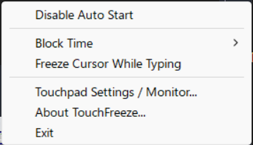
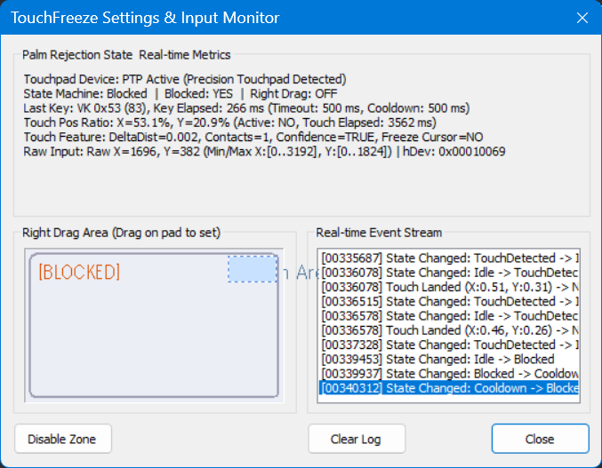

# TouchFreeze

[日本語版はこちら / 日本語版](./README.ja.md)

TouchFreeze is a lightweight Windows utility that blocks accidental touchpad and touchscreen input while you are typing. It runs from the system tray and keeps your cursor where you left it, without disabling the touchpad permanently.

## Why use it?

- Fewer accidental clicks, drags, and cursor jumps when your palm brushes the touchpad.
- No need to disable the touchpad entirely; it is only suppressed briefly around keyboard input.
- Works with both standard touchpads and Windows Precision Touchpads (PTP).
- Right-drag zone lets you perform right-click-and-drag with one finger on a designated area.
- Low CPU and memory footprint; runs as a system-tray background process.

## Screenshots

### System tray menu


Right-click the tray icon to enable auto-start, choose block time, open settings, or freeze the cursor.

### Input monitor


The built-in monitor shows real-time palm-rejection state, touch coordinates, and the event stream so you can tune settings for your device.

## Installation

1. Download `TouchFreeze.msi` from the [Releases](https://github.com/kuwa72/touchfreeze/releases) page.
2. Run the installer.
3. Launch TouchFreeze from the Start menu. It will appear in the system tray.

You can also fetch the latest CI build manually with:

```sh
./scripts/fetch-latest-build.sh
```

## Usage

TouchFreeze works automatically once started.

Right-click the tray icon for settings:

- **Auto Start**: Launch TouchFreeze when Windows starts.
- **Block Time**: How long to suppress input after a key press (300 ms, 500 ms, or 700 ms).
- **Freeze Cursor While Typing**: Also block mouse-cursor movement during the block time.
- **Touchpad Settings / Monitor...**: Open the input monitor and configure right-drag zones.
- **Right Drag Zone**: Choose the touchpad area (e.g., right third, bottom-right corner) used for one-finger right-drag.

## What it does

TouchFreeze installs a low-level keyboard hook and a low-level mouse hook. When you press a key, it starts a short suppression window. During that window, physical clicks and (optionally) cursor movement are blocked. After the window expires, input is allowed again.

For touchpads, it also reads raw HID input to detect multi-touch, confidence, and movement distance. Palm touches are distinguished from intentional cursor movement and can be blocked even after the typing window closes, with a configurable cooldown.

For more details, see [ARCHITECTURE.md](ARCHITECTURE.md).

## System Requirements

- Windows 10 or Windows 11
- Standard touchpad or Windows Precision Touchpad (PTP)

## Development

- **Solution**: `TouchFreeze.sln`
- **Toolset**: Visual Studio 2022, MSBuild v143
- **Build**: `powershell -ExecutionPolicy Bypass -File .\build.ps1`
- **Release**: `bash scripts/release.sh` (WSL) or `powershell -ExecutionPolicy Bypass -File .\release.ps1` (Windows)

## License

See [License.txt](License.txt).
